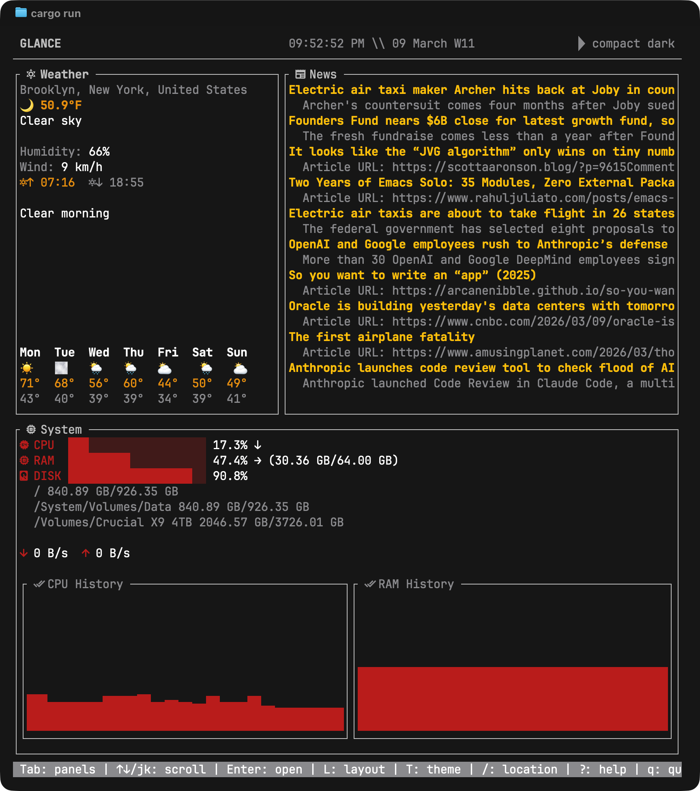

# Glance

A terminal-based dashboard that displays weather, news headlines, and system metrics (CPU, RAM, disk, network) in a single view. Built with Rust and [Ratatui](https://ratatui.rs).

<p align="center">
  
</p>

## Features

- **Weather** — Current temperature, conditions, humidity, wind, sunrise/sunset, 7-day forecast, and a day summary via [Open-Meteo](https://open-meteo.com) (free, no API key required)
- **News** — Scrollable headlines from configurable RSS feeds (defaults to Hacker News and TechCrunch); press Enter to open in browser
- **System monitoring** — CPU, RAM, and disk usage with fill bars and trend arrows (↑↓→), per-disk breakdown, live network RX/TX rates, and rolling CPU/RAM sparklines
- **Responsive layouts** — Wide, Compact, Tall, and Minimal presets; auto-selected by terminal size, or cycle manually with `L`
- **Themes** — Matte Black (default), Dark, Light, and Dracula; cycle with `T`, saved to config
- **Nerd Font support** — Auto-detected glyph icons with emoji/ASCII fallback
- **Location search** — Press `/` to search for any city via Open-Meteo geocoding; auto-selects °F or °C by country
- **Caching** — Weather and news cached with 5-minute TTL

## Install

Requires [Rust](https://rustup.rs) 1.70+.

```sh
git clone https://github.com/geoffsmithBK/glance.git
cd glance
cargo build --release
```

The binary will be at `target/release/glance`.

## Usage

```sh
cargo run
# or
./target/release/glance
```

### Keyboard Shortcuts

| Key | Action |
|-----|--------|
| `q` / `Ctrl+Q` | Quit |
| `Tab` / `Shift+Tab` | Cycle panel focus forward / backward |
| `j` / `↓`, `k` / `↑` | Scroll within active panel |
| `Enter` | Open selected news headline in browser |
| `L` | Cycle layout (Wide → Compact → Tall → Minimal) |
| `T` | Cycle color theme |
| `/` | Open location search |
| `m` | Toggle 12h / 24h time |
| `z` | Toggle local / UTC time |
| `?` | Toggle help overlay |

## Configuration

On first run, a default config file is created at:

- **macOS / Linux**: `~/.config/glance/config.toml` (or `$XDG_CONFIG_HOME/glance/config.toml`)
- **Windows**: `%APPDATA%\glance\config.toml`

### Example config

```toml
[weather]
api_url = "https://api.open-meteo.com/v1/forecast"
temperature_unit = "fahrenheit"
location_name = "Brooklyn, New York, United States"

[weather.location]
lat = 40.6501
lon = -73.9496

[news]
feeds = [
    "https://hnrss.org/frontpage",
    "https://techcrunch.com/feed/",
]

[ui]
refresh_rate_ms = 500
theme = "matte-black"      # matte-black | dark | light | dracula
preferred_layout = "auto"  # auto | wide | compact | tall | minimal
nerd_font = true           # true | false | omit for auto-detect
```

To get weather data, set `[weather.location]` with your latitude and longitude, or just press `/` on first launch to search for your city.

## Dependencies

| Crate | Purpose |
|-------|---------|
| `ratatui` + `crossterm` | Terminal UI rendering |
| `tokio` | Async runtime for network I/O |
| `sysinfo` | CPU, RAM, disk, and network metrics |
| `reqwest` | HTTP client for weather and geocoding APIs |
| `rss` | RSS feed parsing |
| `chrono` | Date/time handling |
| `serde` + `toml` | Config serialization |
| `parking_lot` | Thread-safe TTL cache |
| `fuzzy-matcher` | Fuzzy search for location results |
| `dirs` | Platform-independent config paths |
| `anyhow` | Error handling |

## Platform Support

- **macOS** — Full support
- **Linux** — Full support
- **Windows** — Basic support (CPU, RAM, disk via sysinfo)

## License

MIT
